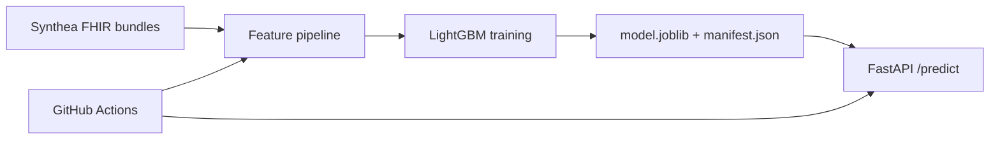

# CareSignal

Production-grade **30-day hospital readmission risk** service built from **FHIR R4** patient bundles.

## Problem

Hospital readmissions within 30 days of discharge are a major quality and cost metric. CareSignal transforms synthetic clinical bundles into patient features, trains a classifier, and serves predictions through a small FastAPI API with a shared Pydantic train/serve schema.

## Architecture



## Quick start

```bash
cd caresignal
python -m venv .venv
.venv\Scripts\activate        # Windows
pip install ".[dev]"

python scripts/run_all.py --fhir-dir data/reference --config config/train.yaml
uvicorn caresignal.api.app:create_app --factory --host 0.0.0.0 --port 8000
```

Open **http://127.0.0.1:8000/** for the demo UI, or `http://127.0.0.1:8000/docs` for interactive API docs.

> If port 8000 is used by another app, start CareSignal on another port (e.g. `--port 8001`) and open that URL instead.

### Example request

```bash
curl -X POST http://127.0.0.1:8000/predict ^
  -H "Content-Type: application/json" ^
  -d "{\"age\":58,\"sex\":\"male\",\"length_of_stay_days\":4.5,\"prior_admissions\":1,\"condition_count\":2,\"procedure_count\":1,\"days_since_last_discharge\":120}"
```

## Generate full training data

### Full synthetic cohort (built-in, recommended)

One command — **5,000 patients** (README target size), replace old `data/raw`, train:

```bash
python scripts/prepare_full_data.py
```

Or step by step:

```bash
python scripts/generate_cohort.py --full
python scripts/run_all.py --fhir-dir data/raw --config config/train.yaml
```

### Synthea (optional)

CareSignal does **not** vendor Synthea. For more realistic clinical patterns:

1. Use [`synthea_dataset_fhir`](../synthea_dataset_fhir) to generate 2,000–5,000 patients.
2. Copy JSON bundles into `data/raw/`.
3. Retrain:

```bash
python scripts/run_all.py --fhir-dir data/raw --config config/train.yaml
```

## Docker

```bash
docker build -t caresignal .
docker run -p 8000:8000 caresignal
```

## Deploy (Render)

1. Push this repo to GitHub.
2. Create a **Web Service** on [Render](https://render.com) from the Dockerfile.
3. Set port `8000` and health check path `/health`.
4. Add the live URL to this README.

## Project layout

| Path | Purpose |
|------|---------|
| `src/caresignal/schemas.py` | Shared Pydantic feature contract |
| `src/caresignal/fhir/` | FHIR parsing and readmission labels |
| `src/caresignal/pipeline.py` | FHIR directory → feature parquet |
| `src/caresignal/train.py` | Train and write model bundle |
| `src/caresignal/api/` | FastAPI serving |
| `data/reference/` | Golden FHIR fixtures for CI |
| `tests/` | Label, pipeline, and API tests |

## Metrics

Run training to refresh `artifacts/manifest.json` and `artifacts/evaluation.json`. Reference cohort metrics are generated locally during `run_all.py`.

Training uses a **patient-level** train/validation/test split, **validation-tuned threshold**, optional **isotonic calibration** (on full cohorts), and **hyperparameter candidates** from `config/train.yaml`.

### Predict input (7 features)

`age`, `sex`, `length_of_stay_days`, `prior_admissions`, `condition_count`, `procedure_count`, `days_since_last_discharge` (0 if first inpatient stay).

## Tests

```bash
ruff check src tests scripts
pytest
```

## Resume bullets

- Built **CareSignal**, a healthcare readmission risk service that transforms **FHIR R4** bundles into features, trains a calibrated classifier, and serves predictions via a **Dockerized FastAPI** API with shared **Pydantic** train/serve schemas and CI-tested golden fixtures.
- Designed a **leakage-safe labeling pipeline** for 30-day readmission and documented model limitations in [`docs/model_card.md`](docs/model_card.md).

## License

MIT
